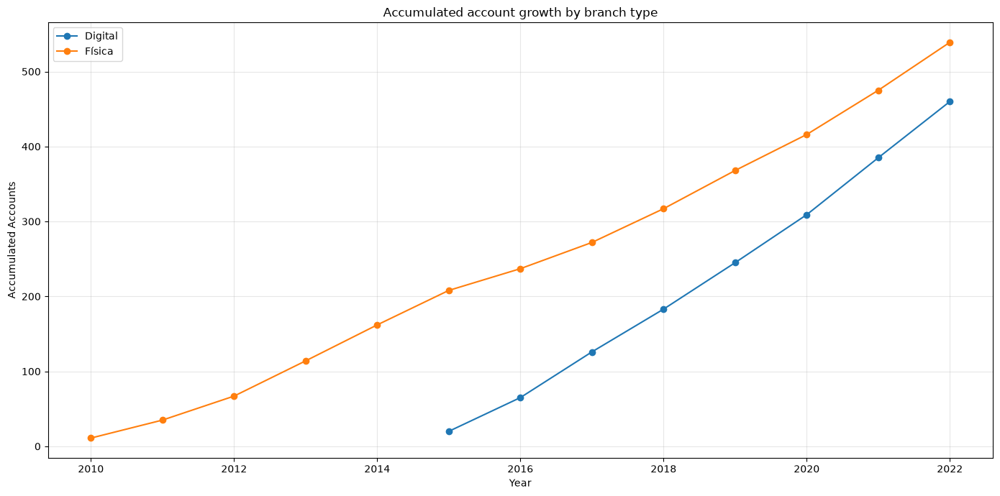
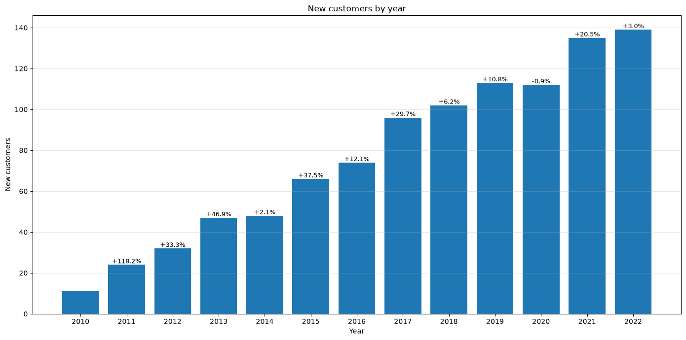
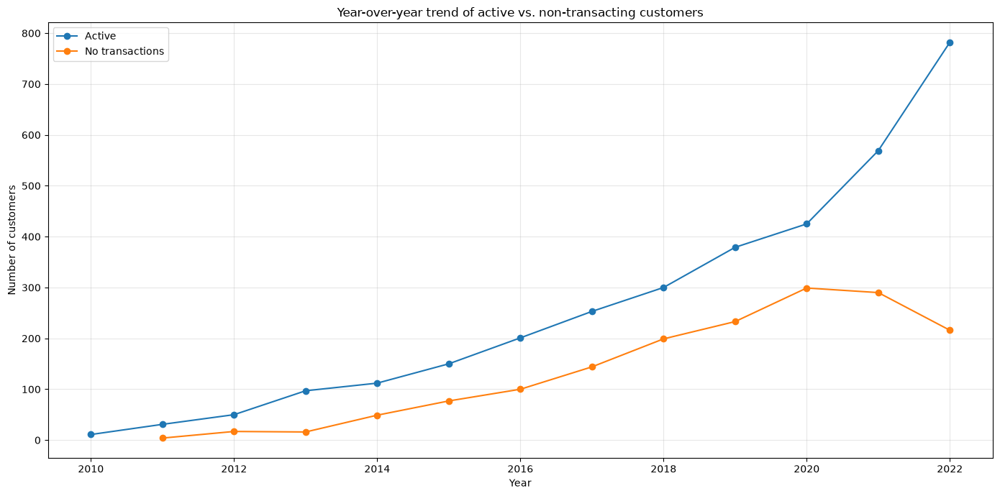
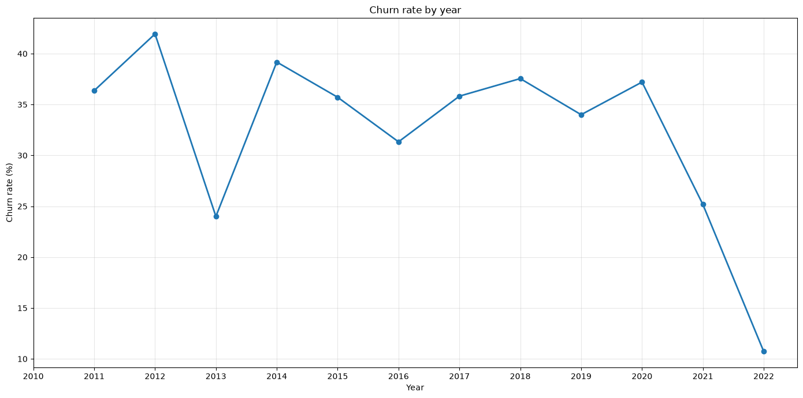
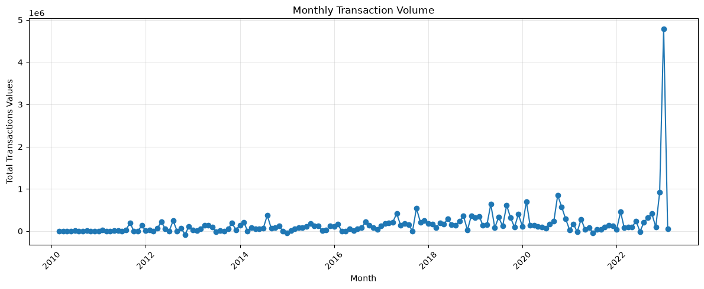
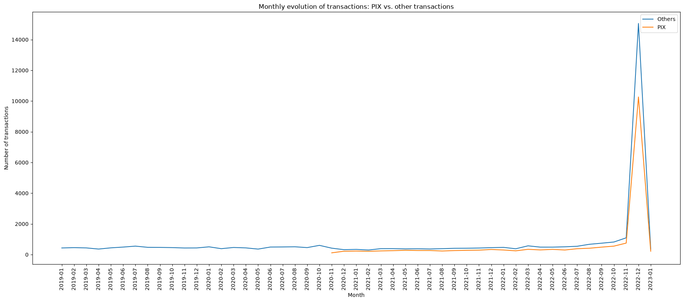

# Project BanVic Bank - Indicium AI's Data Analytics Certification

### Project overview

A project developed as part of the final assessment process for Indicium AI's Data Analytics training program, based on a fictional bank case for BanVic. The project involved data analysis, identification of improvement opportunities, and the application of continuous improvement concepts to support decision-making, using Python and SQL.

Attention! Please note that this notebook is partially written in Brazilian Portuguese, as it was developed as a test project to evaluate my skills as part of the Indicium AI's Data Analytics certification.

### Criterion

- Business: understand BanVic’s problem and address the commercial team's needs
- Analytical capability: select KPIs and visuals that drive actual decisions, not just create pretty charts
- EDA: conduct an organized exploration, justify analyses, and document insights
- Dashboard: ensure effective visualization, UX, storytelling, data validation, and documentation
- Recommendations: translate insights into concrete actions, including demonstrating the value of a data-driven
- Presentation: complete story: problem -> data -> analysis -> discovery -> decision

### Status & improvements

In Progress  [developing]

- [x] Data quality + preparation -> notebooks/main_analyses.ipynb
- [x] EDA + insights -> notebooks/main_analyses.ipynb
- [x] Data loading in PostgreSQL -> notebooks/loading_database.ipynb
- [ ] KPIs + business questions
- [ ] Dashboard mockup
- [ ] Dashboard development
- [ ] Business rules documentation
- [ ] Final presentation

### Data quality observations

> ⚠️ Data Anomaly — Account 528 without customer association

- During the Customers × Accounts analysis, I identified 998 customers and 999 accounts. A referential integrity check revealed that only account 528 references a non-existent customer (cod_cliente = 528).

- The account has a valid agency, assigned employee, and multiple transactions, confirming that it is an active record despite the missing customer reference.

- Treatment: The record was not removed or modified. It will be retained and flagged as a data anomaly in the dataset through the creation of a new column.

### EDA insights

> 🏦 Digital Branch Adoption — August 2015

The analysis shows that digital branches were introduced in August 2015. Following their adoption, transaction volumes across digital and physical branches remained relatively balanced over time, with neither channel consistently dominating the other.

Since the introduction of digital branches in 2015, the number of accounts associated with this channel has grown consistently, reaching 460 cumulative accounts by 2022. Although physical branches still held a larger cumulative account base (539), the gap narrowed from 188 accounts in 2015 to 79 in 2022, indicating progressive adoption of the digital banking channel.

However, during the December 2022 transaction peak, digital branches recorded more than 2,000 additional transactions compared with physical branches. This represents a notable deviation from the historical balance between the two channels.

 **Note:** December 2022 presents an exceptional transaction spike that exceeds the scale used in the visualization. Therefore, this period should be interpreted separately when evaluating the historical trend.

> 📈 Activities and Growth in the number of customers per year

BanVic shows a consistent positive growth in the customer base throughout the analyzed period, with the exception of 2020. 

The decrease in 2020 was negligible, representing a reduction of only 1 customer compared to 2019 (less than 1%). This isolated decline coincides with the COVID-19 pandemic period and may be a contextual factor worth considering when interpreting the result. However, the available data does not establish a causal relationship.

From 2013 to 2020, the number of active and inactive customers followed similar trends, with active customers consistently representing the larger share of the customer base.

During this period, the proportion of active customers gradually declined, reaching 58.7% in 2020. A relevant shift in customer behavior becomes evident from 2020 to 2022.

Customer activity recovered significantly from 2021 onwards, increasing from 58.7% in 2020 to 66.2% in 2021 and reaching 78.4% in 2022.
This recovery indicates a substantial improvement in the transactional engagement level of the customer base during the most recent complete years analyzed.

> ❌ Customer Churn — Transactional Retention

Customer churn remained relatively high throughout most of the analyzed period, ranging from 24.0% to 41.9% between 2011 and 2020.

The highest churn rate was observed in 2012 (41.9%), while 2020 recorded a churn rate of 37.2%. A significant reduction in churn occurred from 2021 onwards, falling to 25.2% in 2021 and 10.7% in 2022.

Between 2020 and 2022, the churn rate decreased by approximately 26.5 percentage points, coinciding with the increase in the customer activity rate previously identified.

This pattern indicates a substantial improvement in customer transactional retention in the most recent complete years analyzed.

**Note:** Adoption churn rate (%) = (inactive customers in the current year / active customers in the previous year) * 100

> 📈 Transaction Peak Analysis — December 2022

- A transaction volume anomaly was identified in December 2022, with 80.7% of transactions occurring on December 29–30.

- The peak was broadly distributed across accounts, but the top 20 accounts by transaction value concentrated 60.54% of the financial movement while representing only 3.61% of transactions.

- The growth in transaction volume observed in December 2022 may be linked to changes in customer usage patterns and the adoption of new payment methods and digital platforms, particularly PIX.

> 💠 PIX Adoption — November 2020

- The analysis indicates that PIX was adopted in November 2020 and remained a relevant transaction channel over time.

- Although PIX transactions remained below the combined volume of other transaction types, the difference became relatively small considering that the comparison aggregates multiple channels, including credit and debit card transactions.

- During the December 2022 transaction peak, PIX accounted for 10,267 transactions (40.6%), compared with 15,052 transactions across all other transaction types.

- This suggests that PIX became a significant component of BanVic's transaction activity, although the available data does not support attributing the December 2022 peak exclusively to PIX.

### Prerequisites & used softwares

- WSL Linux/Ubuntu for Windows 11 System
- Python version 3.12.3
- PostgreSQL version 18.6
- Power BI version 2.157.879
- Figma account

> Attention! Consult the requirements.txt file for more information about python libraries used.

### Collaborators

<table>
  <tr>
    <td align="center">
      <a href="https://github.com/luiz-ed-ferreira" title="Luiz Eduardo">
         
        
          <b>Luiz Eduardo</b>
        
      </a>
    </td>
</table>
